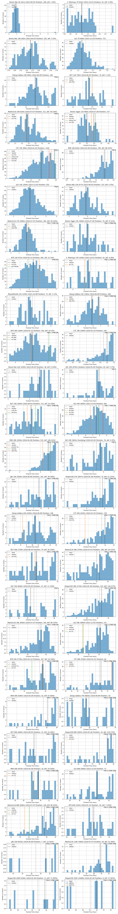

# Statistik Event Trail/Ultra Running Indonesia

Berikut distribusi finisher dari race-race yang terdata, diurutkan bds median finish time, agar bisa dikira-kira tingkat kesulitan dari race itu.

Tapii... harap diwaspadai, distribusi hanya menghitung finish time dari finisher. Harap diperhatikan juga DNF ratenya. Kalau median finish time lebih rendah tapi DNF rate lebih tinggi, kemungkinan racenya lebih berat (misalnya race2 MSR).

Beberapa race juga tidak memberikan data peserta yang over COT atau DNF (misalnya CTC 30K 2024). Dari bentuk distribusinya, kalau puncaknya di kanan (left skewed) maka kemungkinan banyak peserta yg DNF/over COT.

Untuk tiap race juga ditampilkan finish time saya dan bbrp teman yg saya tahu dan selebriti (namanya engga disebut lengkap) biar mantau posisi aja hehe.

Race-race yg terdata:

- Bromo Marathon
- Bromo Tengger Trail Run
- Bali Trail Run (BTR)
- Bali Ultra Trail (BUT)
- Coast to Coast (CTC)
- Dieng Caldera Run
- Jabar Ultra (JBU)
- Mantra116
- Merapi Merbabu De Trail (MMDT)
- Merbabu Sky Race (MSR)
- MesaStila100
- Rinjani100
- Sindoro Sumbing Challenge (SSC)
- Siksorogo Lawu Ultra (SLU)
- Vertical Telomoyo

Gambar di bawah digenerate oleh file .ipynb. Enjoy, dan fork/PR ya.

