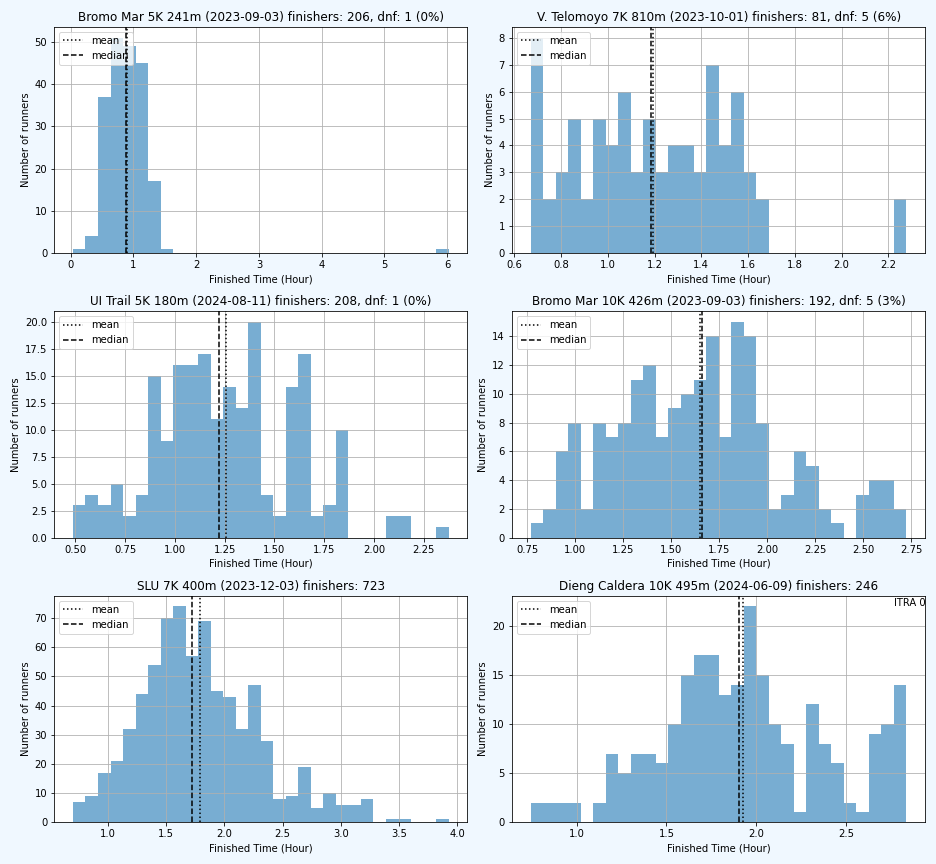
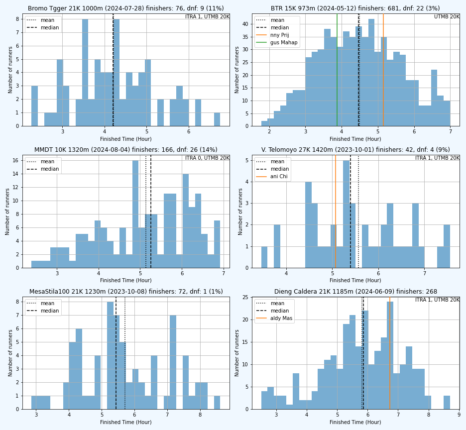
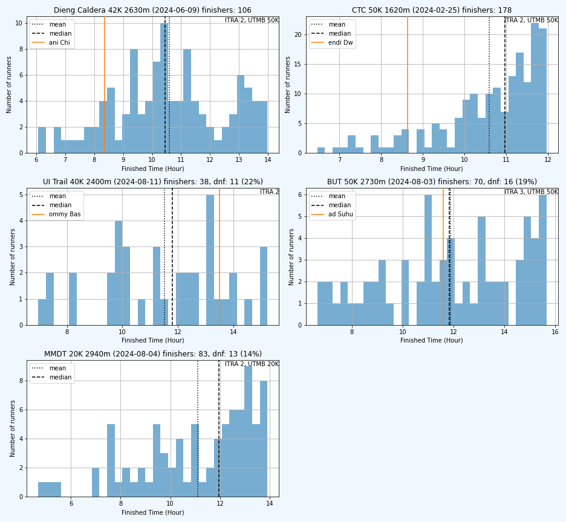
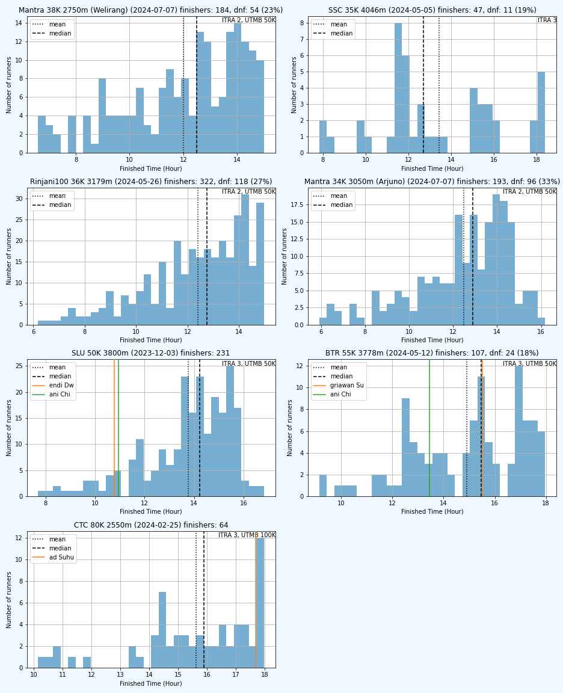
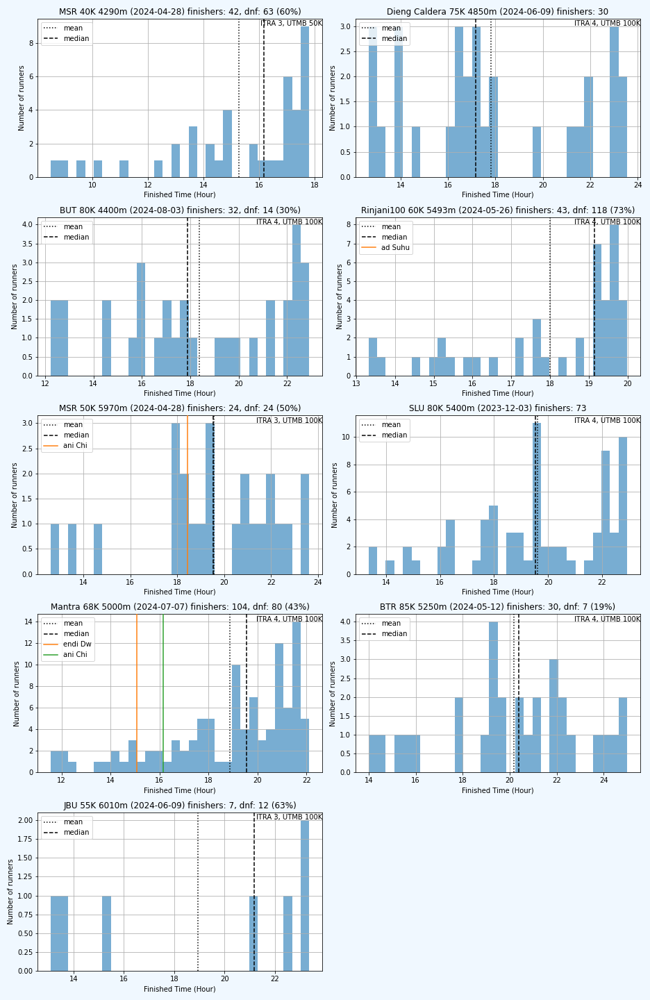
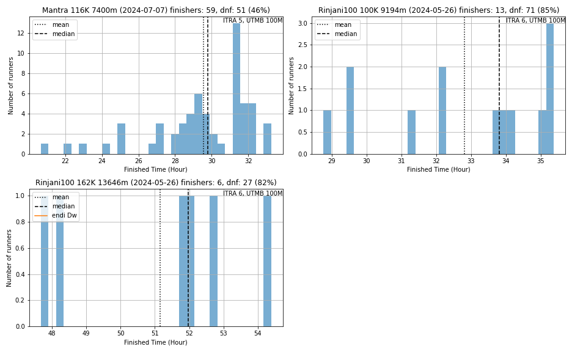

# Statistik Event Trail/Ultra Running Indonesia

Berikut distribusi finisher dari race-race yang terdata, diurutkan bds
median finish time, agar bisa dikira-kira tingkat kesulitan dari race itu.

Tapii... harap diwaspadai, distribusi hanya menghitung finish time dari finisher.
Harap diperhatikan juga DNF ratenya. Kalau median finish time lebih rendah tapi
DNF rate lebih tinggi, kemungkinan racenya lebih berat (misalnya race2 MSR).

Beberapa race juga tidak memberikan data peserta yang over COT atau DNF (misalnya
CTC). Dari bentuk distribusinya, kalau puncaknya di kanan (left skewed, misalnya
CTC 30K, 50K) maka kemungkinan banyak peserta yg DNF/over COT.

Untuk tiap race juga ditampilkan finish time saya dan bbrp teman yg saya tahu dan
selebriti (namanya engga disebut lengkap) biar mantau posisi aja hehe.

Race-race yg terdata:

- Bromo Marathon
- Bromo Tengger Trail Run
- Bali Trail Run (BTR)
- Bali Ultra Trail (BUT)
- Coast to Coast (CTC)
- Dieng Caldera Run
- UI Trail Race
- Jabar Ultra (JBU)
- Mantra116
- Merapi Merbabu De Trail (MMDT)
- Merbabu Sky Race (MSR)
- MesaStila100
- Rinjani100
- Sindoro Sumbing Challenge (SSC)
- Siksorogo Lawu Ultra (SLU)
- Vertical Telomoyo

Enjoy dan fork/PR ya.
## 0 - 2 jam

| Race | Tanggal | Jarak (km) | Eg (m) | Finishers | Median (jam) | Max (jam) | DNF | DNF Rate |
|------|---------|------------|--------|-----------|--------|-----|-----------|----------|
| Bromo Mar | 2023-09-03 | 5 | 241 | 206 | 0.9 | 6.0 | 1 | 0% |
| V. Telomoyo | 2023-10-01 | 7 | 810 | 81 | 1.2 | 2.3 | 5 | 6% |
| UI Trail | 2024-08-11 | 5 | 180 | 208 | 1.2 | 2.4 | 1 | 0% |
| Bromo Mar | 2023-09-03 | 10 | 426 | 192 | 1.7 | 2.7 | 5 | 3% |
| SLU | 2023-12-03 | 7 | 400 | 723 | 1.7 | 3.9 |     |     |
| Dieng Caldera | 2024-06-09 | 10 | 495 | 246 | 1.9 | 2.8 |     |     |

## 2 - 4 jam

| Race | Tanggal | Jarak (km) | Eg (m) | Finishers | Median (jam) | Max (jam) | DNF | DNF Rate |
|------|---------|------------|--------|-----------|--------|-----|-----------|----------|
| BUT | 2024-08-03 | 12 | 330 | 70 | 2.3 | 3.6 |     |     |
| Mantra | 2024-07-07 | 10 | 620 | 311 | 2.4 | 4.5 | 59 | 16% |
| Bromo Tgger | 2024-07-28 | 11 | 480 | 157 | 2.5 | 4.3 |     |     |
| MMDT | 2024-08-04 | 5 | 700 | 97 | 2.5 | 3.5 | 51 | 34% |
| CTC | 2024-02-25 | 15 | 300 | 1100 | 3.1 | 4.0 |     |     |
| MSR | 2024-04-28 | 10 | 810 | 295 | 3.3 | 4.0 | 98 | 25% |
| SLU | 2023-12-03 | 15 | 1200 | 932 | 3.5 | 5.9 |     |     |
| Bromo Mar | 2023-09-03 | 21 | 977 | 153 | 3.8 | 6.8 | 4 | 3% |
| UI Trail | 2024-08-11 | 10 | 650 | 210 | 3.8 | 7.3 | 2 | 1% |
| Mantra | 2024-07-07 | 17 | 1000 | 265 | 3.9 | 7.6 | 49 | 16% |

## 4 - 6 jam

| Race | Tanggal | Jarak (km) | Eg (m) | Finishers | Median (jam) | Max (jam) | DNF | DNF Rate |
|------|---------|------------|--------|-----------|--------|-----|-----------|----------|
| Bromo Tgger | 2024-07-28 | 21 | 1000 | 76 | 4.2 | 6.8 | 9 | 11% |
| BTR | 2024-05-12 | 15 | 973 | 681 | 4.5 | 7.0 | 22 | 3% |
| MMDT | 2024-08-04 | 10 | 1320 | 166 | 5.3 | 6.9 | 26 | 14% |
| V. Telomoyo | 2023-10-01 | 27 | 1420 | 42 | 5.4 | 7.6 | 4 | 9% |
| MesaStila100 | 2023-10-08 | 21 | 1230 | 72 | 5.4 | 8.6 | 1 | 1% |
| Dieng Caldera | 2024-06-09 | 21 | 1185 | 268 | 5.9 | 8.7 |     |     |

## 6 - 8 jam

| Race | Tanggal | Jarak (km) | Eg (m) | Finishers | Median (jam) | Max (jam) | DNF | DNF Rate |
|------|---------|------------|--------|-----------|--------|-----|-----------|----------|
| BTR | 2024-05-12 | 30 | 1340 | 302 | 6.1 | 9.0 | 10 | 3% |
| CTC | 2024-02-25 | 30 | 1040 | 245 | 6.5 | 7.0 |     |     |
| UI Trail | 2024-08-11 | 20 | 1500 | 150 | 6.9 | 10.1 | 11 | 7% |
| Bromo Mar | 2023-09-03 | 42 | 1930 | 38 | 7.0 | 8.5 | 9 | 19% |
| SSC | 2024-05-05 | 20 | 2076 | 65 | 7.4 | 9.0 | 5 | 7% |
| BUT | 2024-08-03 | 25 | 1650 | 111 | 7.5 | 12.2 | 24 | 18% |
| SLU | 2023-12-03 | 30 | 1800 | 645 | 7.6 | 10.0 |     |     |
| MSR | 2024-04-28 | 20 | 1830 | 532 | 7.6 | 9.0 | 149 | 22% |
| SSC | 2024-05-05 | 20 | 1963 | 76 | 7.7 | 8.9 | 4 | 5% |
| JBU | 2024-06-09 | 22 | 2500 | 101 | 7.8 | 10.0 | 39 | 28% |
| Rinjani100 | 2024-05-26 | 27 | 1847 | 75 | 7.8 | 9.0 | 21 | 22% |

## 8 - 12 jam

| Race | Tanggal | Jarak (km) | Eg (m) | Finishers | Median (jam) | Max (jam) | DNF | DNF Rate |
|------|---------|------------|--------|-----------|--------|-----|-----------|----------|
| Dieng Caldera | 2024-06-09 | 42 | 2630 | 106 | 10.5 | 14.0 |     |     |
| CTC | 2024-02-25 | 50 | 1620 | 178 | 11.0 | 12.0 |     |     |
| UI Trail | 2024-08-11 | 40 | 2400 | 38 | 11.8 | 15.2 | 11 | 22% |
| BUT | 2024-08-03 | 50 | 2730 | 70 | 11.8 | 15.7 | 16 | 19% |
| MMDT | 2024-08-04 | 20 | 2940 | 83 | 12.0 | 13.9 | 13 | 14% |

## 12 - 16 jam

| Race | Tanggal | Jarak (km) | Eg (m) | Finishers | Median (jam) | Max (jam) | DNF | DNF Rate |
|------|---------|------------|--------|-----------|--------|-----|-----------|----------|
| Mantra | 2024-07-07 | 38 | 2750 | 184 | 12.5 | 15.0 | 54 | 23% |
| SSC | 2024-05-05 | 35 | 4046 | 47 | 12.7 | 18.4 | 11 | 19% |
| Rinjani100 | 2024-05-26 | 36 | 3179 | 322 | 12.8 | 15.0 | 118 | 27% |
| Mantra | 2024-07-07 | 34 | 3050 | 193 | 12.9 | 16.2 | 96 | 33% |
| SLU | 2023-12-03 | 50 | 3800 | 231 | 14.2 | 16.8 |     |     |
| BTR | 2024-05-12 | 55 | 3778 | 107 | 15.5 | 18.0 | 24 | 18% |
| CTC | 2024-02-25 | 80 | 2550 | 64 | 15.9 | 18.0 |     |     |

## 16 - 24 jam

| Race | Tanggal | Jarak (km) | Eg (m) | Finishers | Median (jam) | Max (jam) | DNF | DNF Rate |
|------|---------|------------|--------|-----------|--------|-----|-----------|----------|
| MSR | 2024-04-28 | 40 | 4290 | 42 | 16.2 | 17.8 | 63 | 60% |
| Dieng Caldera | 2024-06-09 | 75 | 4850 | 30 | 17.2 | 23.6 |     |     |
| BUT | 2024-08-03 | 80 | 4400 | 32 | 17.9 | 22.9 | 14 | 30% |
| Rinjani100 | 2024-05-26 | 60 | 5493 | 43 | 19.1 | 20.0 | 118 | 73% |
| MSR | 2024-04-28 | 50 | 5970 | 24 | 19.5 | 23.6 | 24 | 50% |
| SLU | 2023-12-03 | 80 | 5400 | 73 | 19.5 | 22.9 |     |     |
| Mantra | 2024-07-07 | 68 | 5000 | 104 | 19.5 | 22.1 | 80 | 43% |
| BTR | 2024-05-12 | 85 | 5250 | 30 | 20.4 | 25.0 | 7 | 19% |
| JBU | 2024-06-09 | 55 | 6010 | 7 | 21.2 | 23.4 | 12 | 63% |
| UI Trail | 2024-08-11 | 80 | 4800 | 11 | 21.2 | 23.7 | 18 | 62% |

## 24 - 100 jam

| Race | Tanggal | Jarak (km) | Eg (m) | Finishers | Median (jam) | Max (jam) | DNF | DNF Rate |
|------|---------|------------|--------|-----------|--------|-----|-----------|----------|
| Mantra | 2024-07-07 | 116 | 7400 | 59 | 29.8 | 33.3 | 51 | 46% |
| Rinjani100 | 2024-05-26 | 100 | 9194 | 13 | 33.8 | 35.4 | 71 | 85% |
| Rinjani100 | 2024-05-26 | 162 | 13646 | 6 | 52.0 | 54.4 | 27 | 82% |

(Catatan: file ini dihasilkan oleh kode di .ipynb)
