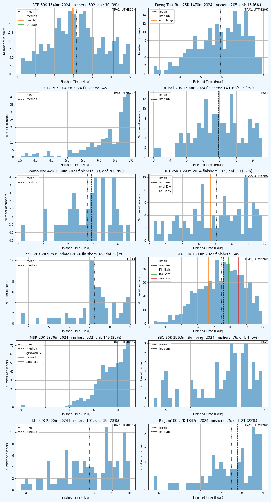
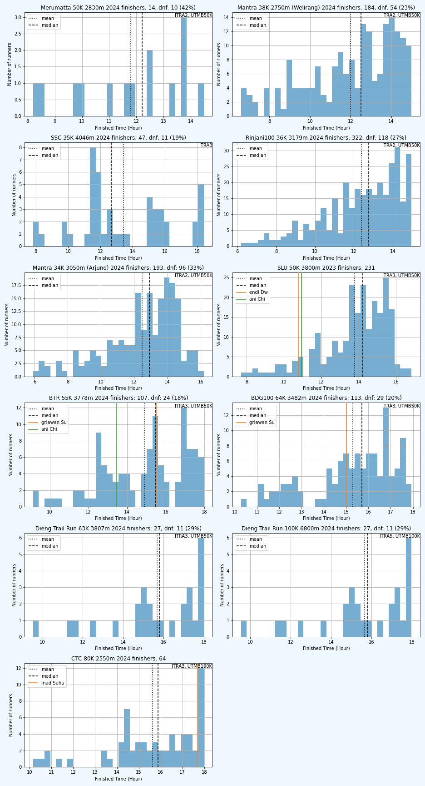

# Statistik Event Trail/Ultra Running Indonesia

Berikut distribusi finisher dari lomba-lomba yang terdata, diurutkan bds
median finish time, agar bisa dikira-kira tingkat kesulitan dari lomba itu.

Tapii... harap diwaspadai, distribusi hanya menghitung finish time dari finisher.
Harap diperhatikan juga DNF ratenya. Kalau median finish time lebih rendah tapi
DNF rate lebih tinggi, kemungkinan lombanya lebih berat (misalnya lomba2 MSR).

Beberapa event juga tidak memberikan data peserta yang over COT atau DNF (misalnya
CTC). Dari bentuk distribusinya, kalau puncaknya di kanan (left skewed, misalnya
CTC 30K, 50K) maka kemungkinan banyak peserta yg DNF/over COT.

Untuk tiap lomba juga ditampilkan kualifikasi [ITRA](https://itra.run) and
[UTMB](https://utmb.world/), [ITRA mountain level](https://itra.run/FAQ/Runner) dan
[ITRA finisher level](https://itra.run/FAQ/Runner), dan finish time saya dan bbrp
teman yg saya tahu dan selebriti (namanya engga disebut lengkap) biar mantau posisi
aja hehe.

Event-event yg terdata:

1. **Bali Trail Run** (BTR): tanggal 2024-05-12
    - 5 lomba: [7](#BTR7), [15](#BTR15), [30](#BTR30), [55](#BTR55), [85](#BTR85) km
    - diikuti sekitar 1494 peserta
    - links: [homepage](https://balitrailrunning.com) |  [instagram](https://www.instagram.com/balitrailrunning/) | [ITRA](https://itra.run/Races/RaceDetails/89832/)
2. **Bali Ultra Trail** (BUT): tanggal 2024-08-03
    - 4 lomba: [12](#BUT12), [25](#BUT25), [50](#BUT50), [80](#BUT80) km
    - diikuti sekitar 337 peserta
    - links: [homepage](https://baliultratrail.com) |  [instagram](https://www.instagram.com/baliultratrail.official/) | [ITRA](https://itra.run/Races/RaceDetails/86937/)
3. **BDG100** (BDG100): tanggal 2024-09-01
    - 5 lomba: [13](#BDG10013), [27](#BDG10027), [64](#BDG10064), [98](#BDG10098), [161](#BDG100161) km
    - diikuti sekitar 885 peserta
    - links: [homepage](https://bdg100.id) |  [instagram](https://www.instagram.com/bdg100_official/) | [ITRA](https://itra.run/Races/RaceDetails/91617/)
4. **Bromo Marathon** (Bromo Mar): tanggal 2023-09-03
    - 4 lomba: [5](#BromoMar5), [10](#BromoMar10), [21](#BromoMar21), [42](#BromoMar42) km
    - diikuti sekitar 608 peserta
    - links: [homepage](https://bromomarathon.com) |  [instagram](https://www.instagram.com/bromomarathon/)
5. **Bromo Tengger Trail Run** (Bromo Tgger): tanggal 2024-07-28
    - 2 lomba: [11](#BromoTgger11), [21](#BromoTgger21) km
    - diikuti sekitar 242 peserta
    - links:  [instagram](https://www.instagram.com/bromo.tenggertrailrun/) | [ITRA](https://itra.run/Races/RaceDetails/93006/)
6. **Coast to Coast** (CTC): tanggal 2024-02-25
    - 5 lomba: [5](#CTC5), [15](#CTC15), [30](#CTC30), [50](#CTC50), [80](#CTC80) km
    - diikuti sekitar 1587 peserta
    - links: [homepage](https://ctcultra.com) |  [instagram](https://www.instagram.com/ctc.ultra/) | [ITRA](https://itra.run/Races/RaceDetails/88662/)
7. **Dieng Caldera Race** (Dieng Caldera): tanggal 2024-06-09
    - 4 lomba: [10](#DiengCaldera10), [21](#DiengCaldera21), [42](#DiengCaldera42), [75](#DiengCaldera75) km
    - diikuti sekitar 650 peserta
    - links: [homepage](https://diengcalderarace.com) |  [instagram](https://www.instagram.com/diengcalderarace/) | [ITRA](https://itra.run/Races/RaceDetails/93604/)
8. **Dieng Trail Run** (Dieng Trail Run): tanggal 2024-09-22
    - 4 lomba: [12](#DiengTrailRun12), [25](#DiengTrailRun25), [63](#DiengTrailRun63), [100](#DiengTrailRun100) km
    - diikuti sekitar 623 peserta
    - links: [homepage](https://diengtrailrun.id) |  [instagram](https://www.instagram.com/diengtrailrun/) | [ITRA](https://itra.run/Races/RaceDetails/95482/)
9. **Jabar Ultra Trail** (JUT): tanggal 2024-06-09
    - 2 lomba: [22](#JUT22), [55](#JUT55) km
    - diikuti sekitar 159 peserta
    - links: [homepage](https://jabarultra.com) |  [instagram](https://www.instagram.com/jabarultra/) | [ITRA](https://itra.run/Races/RaceDetails/92806/)
10. **Mantra 116** (Mantra): tanggal 2024-07-07
    - 6 lomba: [10](#Mantra10), [17](#Mantra17), [34](#Mantra34), [38](#Mantra38), [68](#Mantra68), [116](#Mantra116) km
    - diikuti sekitar 1505 peserta
    - links: [homepage](https://mantra116.com) |  [instagram](https://www.instagram.com/mantra116.id/) | [ITRA](https://itra.run/Races/RaceDetails/90032/)
11. **Merapi Merbabu De Trail** (MMDT): tanggal 2024-08-04
    - 3 lomba: [5](#MMDT5), [10](#MMDT10), [20](#MMDT20) km
    - diikuti sekitar 436 peserta
    - links: [homepage](https://www.merapimerbabudetrail.com) |  [instagram](https://www.instagram.com/merapi_merbabu.detrail/) | [ITRA](https://itra.run/Races/RaceDetails/90917/)
12. **Merbabu Sky Race** (MSR): tanggal 2024-04-28
    - 5 lomba: [5](#MSR5), [10](#MSR10), [20](#MSR20), [40](#MSR40), [50](#MSR50) km
    - diikuti sekitar 1434 peserta
    - links: [homepage](https://merbabuskyrace.com) |  [instagram](https://www.instagram.com/merbabu_skyrace/) | [ITRA](https://itra.run/Races/RaceDetails/84613/)
13. **Mesastila 100** (MesaStila100): tanggal 2023-10-08
    - 1 lomba: [21](#MesaStila10021) km
    - diikuti sekitar 73 peserta
    - links: [homepage](https://mesastila100.com) |  [instagram](https://www.instagram.com/mesastila100/) | [ITRA](https://itra.run/Races/RaceDetails/82926/)
14. **Rinjani 100** (Rinjani100): tanggal 2024-05-26
    - 5 lomba: [27](#Rinjani10027), [36](#Rinjani10036), [60](#Rinjani10060), [100](#Rinjani100100), [162](#Rinjani100162) km
    - diikuti sekitar 814 peserta
    - links: [homepage](https://fonesport.id/rinjani100) |  [instagram](https://www.instagram.com/rinjani100.official/) | [ITRA](https://itra.run/Races/RaceDetails/91507/)
15. **Siksorogo Lawu Ultra** (SLU): tanggal 2023-12-03
    - 5 lomba: [7](#SLU7), [15](#SLU15), [30](#SLU30), [50](#SLU50), [80](#SLU80) km
    - diikuti sekitar 2604 peserta
    - links: [homepage](https://siksorogo.id) |  [instagram](https://www.instagram.com/siksorogolawuultra/) | [ITRA](https://itra.run/Races/RaceDetails/88372/)
16. **Sindoro Sumbing Challenge** (SSC): tanggal 2024-05-05
    - 3 lomba: [20](#SSC20), [20](#SSC20), [35](#SSC35) km
    - diikuti sekitar 208 peserta
    - links: [homepage](https://www.sindorosumbingchallenge.com/) |  [instagram](https://www.instagram.com/sindoro_sumbing_challenge/) | [ITRA](https://itra.run/Races/RaceDetails/89387/)
17. **UI Trail Race** (UI Trail): tanggal 2024-08-11
    - 5 lomba: [5](#UITrail5), [10](#UITrail10), [20](#UITrail20), [40](#UITrail40), [80](#UITrail80) km
    - diikuti sekitar 660 peserta
    - links: [homepage](https://uitrailrun.com) |  [instagram](https://www.instagram.com/uitrailrace/) | [ITRA](https://itra.run/Races/RaceDetails/94755/)
18. **Vertical Telomoyo** (V. Telomoyo): tanggal 2023-10-01
    - 2 lomba: [7](#VTelomoyo7), [27](#VTelomoyo27) km
    - diikuti sekitar 132 peserta
    - links: [homepage](https://verticaltelomoyo.com) |  [instagram](https://www.instagram.com/vertical_telomoyo/) | [ITRA](https://itra.run/Races/RaceDetails/85282/)

Enjoy dan fork/PR ya.
## 0 - 2 jam

| Event | Jarak (km) | Eg (m) | Finish ers | Med / Max (jam) | DNF (Rate) | Kualif. | Mtn Lvl | Fns Lvl |
|-------|------------|--------|-----------|-----------------|------------|---------|---------|---------|
|  [CTC](https://www.instagram.com/ctc.ultra/) | 5 | 30 |  | 0.6 / - |      |  |  |  |
|  [Bromo Mar](https://www.instagram.com/bromomarathon/) | 5 | 241 | 206 | 0.9 / 6.0 | 1 (0%) |  |  |  |
|  [MSR](https://www.instagram.com/merbabu_skyrace/) | 5 | 170 | 207 | 1.0 / 1.7 |      |  |  |  |
|  [V. Telomoyo](https://www.instagram.com/vertical_telomoyo/) | 7 | 810 | 81 | 1.2 / 2.3 | 5 (6%) |   | 11 | 190 |
|  [BTR](https://www.instagram.com/balitrailrunning/) | 7 | 300 | 311 | 1.2 / 2.7 |      |  |  |  |
|  [UI Trail](https://www.instagram.com/uitrailrace/) | 5 | 180 | 208 | 1.2 / 2.4 | 1 (0%) |  | 3 | 130 |
|  [Bromo Mar](https://www.instagram.com/bromomarathon/) | 10 | 426 | 192 | 1.7 / 2.7 | 5 (3%) |  |  |  |
|  [SLU](https://www.instagram.com/siksorogolawuultra/) | 7 | 400 | 723 | 1.7 / 3.9 |      |  |  |  |
|  [Dieng Caldera](https://www.instagram.com/diengcalderarace/) | 10 | 495 | 246 | 1.9 / 2.8 |      |   | 5 | 130 |

## 2 - 4 jam

| Event | Jarak (km) | Eg (m) | Finish ers | Med / Max (jam) | DNF (Rate) | Kualif. | Mtn Lvl | Fns Lvl |
|-------|------------|--------|-----------|-----------------|------------|---------|---------|---------|
|  [BUT](https://www.instagram.com/baliultratrail.official/) | 12 | 330 | 70 | 2.3 / 3.6 |      |   | 3 | 170 |
|  [Mantra](https://www.instagram.com/mantra116.id/) | 10 | 620 | 311 | 2.4 / 4.5 | 59 (16%) |   | 6 | 140 |
|  [Bromo Tgger](https://www.instagram.com/bromo.tenggertrailrun/) | 11 | 480 | 157 | 2.5 / 4.3 |      |  |  |  |
|  [MMDT](https://www.instagram.com/merapi_merbabu.detrail/) | 5 | 700 | 97 | 2.5 / 3.5 | 51 (34%) |   | 11 | 150 |
|  [BDG100](https://www.instagram.com/bdg100_official/) | 13 | 724 | 391 | 2.9 / 4.2 | 14 (3%) |    | 5 | 290 |
|  [CTC](https://www.instagram.com/ctc.ultra/) | 15 | 300 | 1100 | 3.1 / 4.0 |      |   | 2 | 160 |
|  [MSR](https://www.instagram.com/merbabu_skyrace/) | 10 | 810 | 295 | 3.3 / 4.0 | 98 (25%) |   | 9 | 210 |
|  [SLU](https://www.instagram.com/siksorogolawuultra/) | 15 | 1200 | 932 | 3.5 / 5.9 |      |   | 6 |  |
|  [UI Trail](https://www.instagram.com/uitrailrace/) | 10 | 650 | 198 | 3.7 / 5.7 | 14 (7%) |   | 6 | 130 |
|  [Dieng Trail Run](https://www.instagram.com/diengtrailrun/) | 12 | 920 | 283 | 3.8 / 5.0 | 46 (14%) |   | 6 | 190 |
|  [Bromo Mar](https://www.instagram.com/bromomarathon/) | 21 | 977 | 153 | 3.8 / 6.8 | 4 (3%) |  |  |  |
|  [Mantra](https://www.instagram.com/mantra116.id/) | 17 | 1000 | 265 | 3.9 / 7.6 | 49 (16%) |    | 6 | 220 |

## 4 - 6 jam

| Event | Jarak (km) | Eg (m) | Finish ers | Med / Max (jam) | DNF (Rate) | Kualif. | Mtn Lvl | Fns Lvl |
|-------|------------|--------|-----------|-----------------|------------|---------|---------|---------|
|  [Bromo Tgger](https://www.instagram.com/bromo.tenggertrailrun/) | 21 | 1000 | 76 | 4.2 / 6.8 | 9 (11%) |    | 5 | 190 |
|  [BTR](https://www.instagram.com/balitrailrunning/) | 15 | 973 | 681 | 4.5 / 7.0 | 22 (3%) |   |  |  |
|  [MMDT](https://www.instagram.com/merapi_merbabu.detrail/) | 10 | 1320 | 166 | 5.3 / 6.9 | 26 (14%) |    | 12 | 140 |
|  [V. Telomoyo](https://www.instagram.com/vertical_telomoyo/) | 27 | 1420 | 42 | 5.4 / 7.6 | 4 (9%) |    | 5 | 230 |
|  [MesaStila100](https://www.instagram.com/mesastila100/) | 21 | 1230 | 72 | 5.4 / 8.6 | 1 (1%) |   | 6 | 220 |
|  [Dieng Caldera](https://www.instagram.com/diengcalderarace/) | 21 | 1185 | 264 | 5.8 / 7.9 | 4 (1%) |    | 6 | 190 |
|  [BDG100](https://www.instagram.com/bdg100_official/) | 27 | 1265 | 263 | 5.9 / 8.0 | 11 (4%) |    | 5 | 10 |

## 6 - 8 jam

| Event | Jarak (km) | Eg (m) | Finish ers | Med / Max (jam) | DNF (Rate) | Kualif. | Mtn Lvl | Fns Lvl |
|-------|------------|--------|-----------|-----------------|------------|---------|---------|---------|
|  [BTR](https://www.instagram.com/balitrailrunning/) | 30 | 1340 | 302 | 6.1 / 9.0 | 10 (3%) |    | 4 | 230 |
|  [Dieng Trail Run](https://www.instagram.com/diengtrailrun/) | 25 | 1470 | 205 | 6.1 / 8.0 | 13 (6%) |    | 5 | 200 |
|  [CTC](https://www.instagram.com/ctc.ultra/) | 30 | 1040 | 245 | 6.5 / 7.0 |      |    | 3 | 250 |
|  [UI Trail](https://www.instagram.com/uitrailrace/) | 20 | 1500 | 149 | 6.9 / 9.6 | 12 (7%) |   | 7 | 150 |
|  [Bromo Mar](https://www.instagram.com/bromomarathon/) | 42 | 1930 | 38 | 7.0 / 8.5 | 9 (19%) |  |  |  |
|  [BUT](https://www.instagram.com/baliultratrail.official/) | 25 | 1650 | 105 | 7.3 / 9.9 | 30 (22%) |    | 7 | 190 |
|  [SSC](https://www.instagram.com/sindoro_sumbing_challenge/) | 20 | 2076 | 65 | 7.4 / 9.0 | 5 (7%) |   | 12 | 190 |
|  [SLU](https://www.instagram.com/siksorogolawuultra/) | 30 | 1800 | 645 | 7.6 / 10.0 |      |    | 7 | 210 |
|  [MSR](https://www.instagram.com/merbabu_skyrace/) | 20 | 1830 | 532 | 7.6 / 9.0 | 149 (22%) |    | 12 |  |
|  [SSC](https://www.instagram.com/sindoro_sumbing_challenge/) | 20 | 1963 | 76 | 7.7 / 8.9 | 4 (5%) |   | 12 | 190 |
|  [JUT](https://www.instagram.com/jabarultra/) | 22 | 2500 | 101 | 7.8 / 10.0 | 39 (28%) |    | 12 | 180 |
|  [Rinjani100](https://www.instagram.com/rinjani100.official/) | 27 | 1847 | 75 | 7.8 / 9.0 | 21 (22%) |    | 7 | 210 |

## 8 - 12 jam

| Event | Jarak (km) | Eg (m) | Finish ers | Med / Max (jam) | DNF (Rate) | Kualif. | Mtn Lvl | Fns Lvl |
|-------|------------|--------|-----------|-----------------|------------|---------|---------|---------|
|  [Dieng Caldera](https://www.instagram.com/diengcalderarace/) | 42 | 2630 | 106 | 10.5 / 14.0 |      |    | 7 | 260 |
|  [CTC](https://www.instagram.com/ctc.ultra/) | 50 | 1620 | 178 | 11.0 / 12.0 |      |    | 3 | 290 |
|  [UI Trail](https://www.instagram.com/uitrailrace/) | 40 | 2400 | 33 | 11.4 / 14.0 | 16 (33%) |   | 7 | 220 |
|  [BUT](https://www.instagram.com/baliultratrail.official/) | 50 | 2730 | 70 | 11.8 / 15.7 | 16 (19%) |    | 6 | 270 |
|  [MMDT](https://www.instagram.com/merapi_merbabu.detrail/) | 20 | 2940 | 83 | 12.0 / 13.9 | 13 (14%) |    | 12 | 140 |

## 12 - 16 jam

| Event | Jarak (km) | Eg (m) | Finish ers | Med / Max (jam) | DNF (Rate) | Kualif. | Mtn Lvl | Fns Lvl |
|-------|------------|--------|-----------|-----------------|------------|---------|---------|---------|
|  [Mantra](https://www.instagram.com/mantra116.id/) | 38 | 2750 | 184 | 12.5 / 15.0 | 54 (23%) |    | 9 | 220 |
|  [SSC](https://www.instagram.com/sindoro_sumbing_challenge/) | 35 | 4046 | 47 | 12.7 / 18.4 | 11 (19%) |   | 12 | 180 |
|  [Rinjani100](https://www.instagram.com/rinjani100.official/) | 36 | 3179 | 322 | 12.8 / 15.0 | 118 (27%) |    | 11 |  |
|  [Mantra](https://www.instagram.com/mantra116.id/) | 34 | 3050 | 193 | 12.9 / 16.2 | 96 (33%) |    | 12 | 200 |
|  [SLU](https://www.instagram.com/siksorogolawuultra/) | 50 | 3800 | 231 | 14.2 / 16.8 |      |    | 8 | 280 |
|  [BTR](https://www.instagram.com/balitrailrunning/) | 55 | 3778 | 107 | 15.5 / 18.0 | 24 (18%) |    | 9 | 270 |
|  [BDG100](https://www.instagram.com/bdg100_official/) | 64 | 3482 | 113 | 15.7 / 17.9 | 29 (20%) |    | 6 | 10 |
|  [Dieng Trail Run](https://www.instagram.com/diengtrailrun/) | 63 | 3807 | 27 | 15.8 / 18.0 | 11 (29%) |    | 7 | 300 |
|  [Dieng Trail Run](https://www.instagram.com/diengtrailrun/) | 100 | 6800 | 27 | 15.8 / 18.0 | 11 (29%) |    | 9 | 390 |
|  [CTC](https://www.instagram.com/ctc.ultra/) | 80 | 2550 | 64 | 15.9 / 18.0 |      |    | 3 | 370 |

## 16 - 24 jam

| Event | Jarak (km) | Eg (m) | Finish ers | Med / Max (jam) | DNF (Rate) | Kualif. | Mtn Lvl | Fns Lvl |
|-------|------------|--------|-----------|-----------------|------------|---------|---------|---------|
|  [MSR](https://www.instagram.com/merbabu_skyrace/) | 40 | 4290 | 42 | 16.2 / 17.8 | 63 (60%) |    | 12 |  |
|  [Dieng Caldera](https://www.instagram.com/diengcalderarace/) | 75 | 4850 | 30 | 17.2 / 23.6 |      |    | 8 | 290 |
|  [BUT](https://www.instagram.com/baliultratrail.official/) | 80 | 4400 | 32 | 17.9 / 22.9 | 14 (30%) |    |  | 300 |
|  [Rinjani100](https://www.instagram.com/rinjani100.official/) | 60 | 5493 | 43 | 19.1 / 20.0 | 118 (73%) |    | 12 | 280 |
|  [MSR](https://www.instagram.com/merbabu_skyrace/) | 50 | 5970 | 24 | 19.5 / 23.6 | 24 (50%) |    | 12 | 220 |
|  [SLU](https://www.instagram.com/siksorogolawuultra/) | 80 | 5400 | 73 | 19.5 / 22.9 |      |    | 9 | 290 |
|  [Mantra](https://www.instagram.com/mantra116.id/) | 68 | 5000 | 104 | 19.5 / 22.1 | 80 (43%) |    | 10 | 280 |
|  [BTR](https://www.instagram.com/balitrailrunning/) | 85 | 5250 | 30 | 20.4 / 25.0 | 7 (19%) |    | 7 | 320 |
|  [JUT](https://www.instagram.com/jabarultra/) | 55 | 6010 | 7 | 21.2 / 23.4 | 12 (63%) |    | 12 | 220 |
|  [UI Trail](https://www.instagram.com/uitrailrace/) | 80 | 4800 | 11 | 21.2 / 23.7 | 18 (62%) |   | 8 | 320 |

## 24 - 100 jam

| Event | Jarak (km) | Eg (m) | Finish ers | Med / Max (jam) | DNF (Rate) | Kualif. | Mtn Lvl | Fns Lvl |
|-------|------------|--------|-----------|-----------------|------------|---------|---------|---------|
|  [BDG100](https://www.instagram.com/bdg100_official/) | 98 | 5678 | 27 | 28.2 / 31.7 | 18 (40%) |    | 7 | 10 |
|  [Mantra](https://www.instagram.com/mantra116.id/) | 116 | 7400 | 59 | 29.8 / 33.3 | 51 (46%) |    | 9 | 380 |
|  [Rinjani100](https://www.instagram.com/rinjani100.official/) | 100 | 9194 | 13 | 33.8 / 35.4 | 71 (85%) |    | 12 | 350 |
|  [BDG100](https://www.instagram.com/bdg100_official/) | 161 | 8995 | 7 | 43.8 / 44.0 | 12 (63%) |    | 8 | 10 |
|  [Rinjani100](https://www.instagram.com/rinjani100.official/) | 162 | 13646 | 6 | 52.0 / 54.4 | 27 (82%) |    | 12 |  |

(Catatan: file ini dihasilkan oleh kode di .ipynb)
