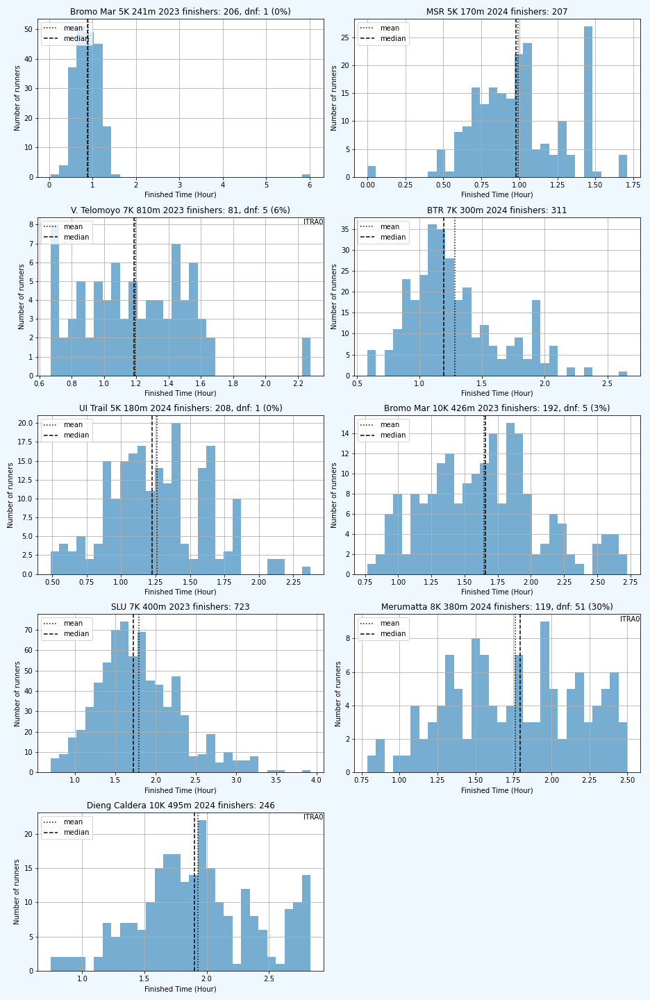
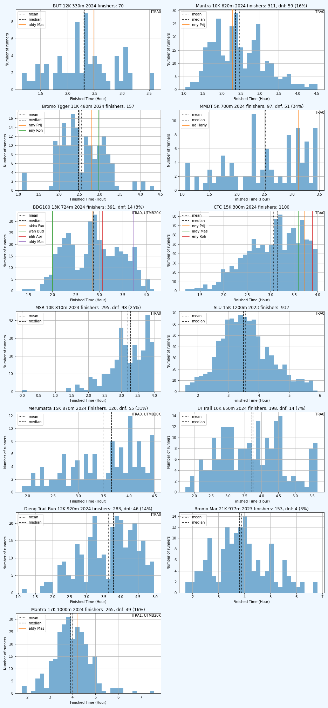
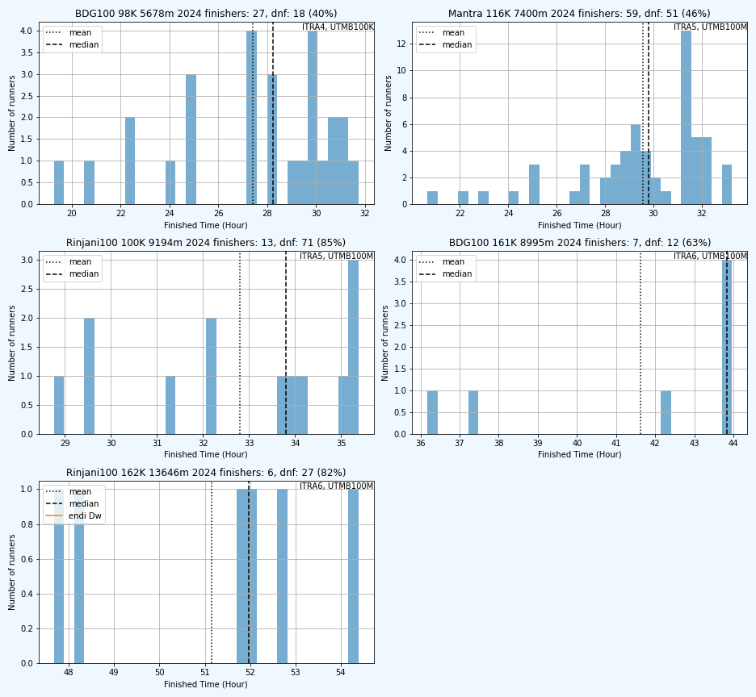

# Statistik Event Trail/Ultra Running Indonesia

Berikut distribusi finisher dari race-race yang terdata, diurutkan bds
median finish time, agar bisa dikira-kira tingkat kesulitan dari race itu.

Tapii... harap diwaspadai, distribusi hanya menghitung finish time dari finisher.
Harap diperhatikan juga DNF ratenya. Kalau median finish time lebih rendah tapi
DNF rate lebih tinggi, kemungkinan racenya lebih berat (misalnya race2 MSR).

Beberapa event juga tidak memberikan data peserta yang over COT atau DNF (misalnya
CTC). Dari bentuk distribusinya, kalau puncaknya di kanan (left skewed, misalnya
CTC 30K, 50K) maka kemungkinan banyak peserta yg DNF/over COT.

Untuk tiap race juga ditampilkan kualifikasi ITRA and ITMB, ITRA mountain level
dan ITRA finisher level, dan finish time saya dan bbrp teman yg saya tahu dan
selebriti (namanya engga disebut lengkap) biar mantau posisi aja hehe.

Event-event yg terdata:

- **Bali Trail Run** (BTR): tanggal 2024-05-12, 5 races (links:    )
- **Bali Ultra Trail** (BUT): tanggal 2024-08-03, 4 races (links:    )
- **Bromo Marathon** (Bromo Mar): tanggal 2023-09-03, 4 races (links:   )
- **Bromo Tengger Trail Run** (Bromo Tgger): tanggal 2024-07-28, 2 races (links:   )
- **Coast to Coast** (CTC): tanggal 2024-02-25, 5 races (links:    )
- **Dieng Caldera Race** (Dieng Caldera): tanggal 2024-06-09, 4 races (links:    )
- **Jabar Ultra Trail** (JUT): tanggal 2024-06-09, 2 races (links:    )
- **Mantra 116** (Mantra): tanggal 2024-07-07, 6 races (links:    )
- **Merapi Merbabu De Trail** (MMDT): tanggal 2024-08-04, 3 races (links:    )
- **Merbabu Sky Race** (MSR): tanggal 2024-04-28, 5 races (links:    )
- **Mesastila 100** (MesaStila100): tanggal 2023-10-08, 1 races (links:    )
- **Rinjani 100** (Rinjani100): tanggal 2024-05-26, 5 races (links:    )
- **Siksorogo Lawu Ultra** (SLU): tanggal 2023-12-03, 5 races (links:    )
- **Sindoro Sumbing Challenge** (SSC): tanggal 2024-05-05, 3 races (links:    )
- **UI Trail Race** (UI Trail): tanggal 2024-08-11, 5 races (links:    )
- **Vertical Telomoyo** (V. Telomoyo): tanggal 2023-10-01, 2 races (links:    )

Enjoy dan fork/PR ya.
## 0 - 2 jam

| Event | Jarak(km) | Eg(m) | Finishers | Median / Max (jam) | DNF (Rate) | Kualif. | Mtn. Lvl | Fns. Lvl |
|------|-----------|-------|-----------|--------------------|------------|-------|----------|----------|
| BTR     | 7 | 300 | 311 | 1.2 / 2.7 |      |  |  |  |
| Bromo Mar    | 5 | 241 | 206 | 0.9 / 6.0 | 1 (0%) |  |  |  |
| Bromo Mar    | 10 | 426 | 192 | 1.7 / 2.7 | 5 (3%) |  |  |  |
| CTC     | 5 | 30 |  | 0.6 / - |      |  |  |  |
| Dieng Caldera     | 10 | 495 | 246 | 1.9 / 2.8 |      | ITRA0 | 5 | 130 |
| MSR     | 5 | 170 | 207 | 1.0 / 1.7 |      |  |  |  |
| SLU     | 7 | 400 | 723 | 1.7 / 3.9 |      |  |  |  |
| UI Trail     | 5 | 180 | 208 | 1.2 / 2.4 | 1 (0%) |  | 3 | 130 |
| V. Telomoyo     | 7 | 810 | 81 | 1.2 / 2.3 | 5 (6%) | ITRA0 | 11 | 190 |

## 2 - 4 jam

| Event | Jarak(km) | Eg(m) | Finishers | Median / Max (jam) | DNF (Rate) | Kualif. | Mtn. Lvl | Fns. Lvl |
|------|-----------|-------|-----------|--------------------|------------|-------|----------|----------|
| BUT     | 12 | 330 | 70 | 2.3 / 3.6 |      | ITRA0 | 3 | 170 |
| Bromo Mar    | 21 | 977 | 153 | 3.8 / 6.8 | 4 (3%) |  |  |  |
| Bromo Tgger    | 11 | 480 | 157 | 2.5 / 4.3 |      |  |  |  |
| CTC     | 15 | 300 | 1100 | 3.1 / 4.0 |      | ITRA0 | 2 | 160 |
| Mantra     | 10 | 620 | 311 | 2.4 / 4.5 | 59 (16%) | ITRA0 | 6 | 140 |
| Mantra     | 17 | 1000 | 265 | 3.9 / 7.6 | 49 (16%) | ITRA1, UTMB20K | 6 | 220 |
| MMDT     | 5 | 700 | 97 | 2.5 / 3.5 | 51 (34%) | ITRA0 | 11 | 150 |
| MSR     | 10 | 810 | 295 | 3.3 / 4.0 | 98 (25%) | ITRA0 | 9 | 210 |
| SLU     | 15 | 1200 | 932 | 3.5 / 5.9 |      | ITRA0 | 6 |  |
| UI Trail     | 10 | 650 | 210 | 3.8 / 7.3 | 2 (1%) | ITRA0 | 6 | 130 |

## 4 - 6 jam

| Event | Jarak(km) | Eg(m) | Finishers | Median / Max (jam) | DNF (Rate) | Kualif. | Mtn. Lvl | Fns. Lvl |
|------|-----------|-------|-----------|--------------------|------------|-------|----------|----------|
| BTR     | 15 | 973 | 681 | 4.5 / 7.0 | 22 (3%) | UTMB20K |  |  |
| Bromo Tgger    | 21 | 1000 | 76 | 4.2 / 6.8 | 9 (11%) | ITRA1, UTMB20K | 5 | 190 |
| Dieng Caldera     | 21 | 1185 | 268 | 5.9 / 8.7 |      | ITRA1, UTMB20K | 6 | 190 |
| MMDT     | 10 | 1320 | 166 | 5.3 / 6.9 | 26 (14%) | ITRA0, UTMB20K | 12 | 140 |
| MesaStila100     | 21 | 1230 | 72 | 5.4 / 8.6 | 1 (1%) | ITRA0 | 6 | 220 |
| V. Telomoyo     | 27 | 1420 | 42 | 5.4 / 7.6 | 4 (9%) | ITRA1, UTMB20K | 5 | 230 |

## 6 - 8 jam

| Event | Jarak(km) | Eg(m) | Finishers | Median / Max (jam) | DNF (Rate) | Kualif. | Mtn. Lvl | Fns. Lvl |
|------|-----------|-------|-----------|--------------------|------------|-------|----------|----------|
| BTR     | 30 | 1340 | 302 | 6.1 / 9.0 | 10 (3%) | ITRA1, UTMB20K | 4 | 230 |
| BUT     | 25 | 1650 | 111 | 7.5 / 12.2 | 24 (18%) | ITRA2, UTMB20K | 7 | 190 |
| Bromo Mar    | 42 | 1930 | 38 | 7.0 / 8.5 | 9 (19%) |  |  |  |
| CTC     | 30 | 1040 | 245 | 6.5 / 7.0 |      | ITRA0, UTMB20K | 3 | 250 |
| JUT     | 22 | 2500 | 101 | 7.8 / 10.0 | 39 (28%) | ITRA2, UTMB20K | 12 | 180 |
| MSR     | 20 | 1830 | 532 | 7.6 / 9.0 | 149 (22%) | ITRA1, UTMB20K | 12 |  |
| Rinjani100     | 27 | 1847 | 75 | 7.8 / 9.0 | 21 (22%) | ITRA1, UTMB20K | 7 | 210 |
| SLU     | 30 | 1800 | 645 | 7.6 / 10.0 |      | ITRA1, UTMB20K | 7 | 210 |
| SSC     | 20 | 1963 | 76 | 7.7 / 8.9 | 4 (5%) | ITRA1 | 12 | 190 |
| SSC     | 20 | 2076 | 65 | 7.4 / 9.0 | 5 (7%) | ITRA1 | 12 | 190 |
| UI Trail     | 20 | 1500 | 150 | 6.9 / 10.1 | 11 (7%) | ITRA1 | 7 | 150 |

## 8 - 12 jam

| Event | Jarak(km) | Eg(m) | Finishers | Median / Max (jam) | DNF (Rate) | Kualif. | Mtn. Lvl | Fns. Lvl |
|------|-----------|-------|-----------|--------------------|------------|-------|----------|----------|
| BUT     | 50 | 2730 | 70 | 11.8 / 15.7 | 16 (19%) | ITRA3, UTMB50K | 6 | 270 |
| CTC     | 50 | 1620 | 178 | 11.0 / 12.0 |      | ITRA2, UTMB50K | 3 | 290 |
| Dieng Caldera     | 42 | 2630 | 106 | 10.5 / 14.0 |      | ITRA2, UTMB50K | 7 | 260 |
| MMDT     | 20 | 2940 | 83 | 12.0 / 13.9 | 13 (14%) | ITRA2, UTMB20K | 12 | 140 |
| UI Trail     | 40 | 2400 | 38 | 11.8 / 15.2 | 11 (22%) | ITRA2 | 7 | 220 |

## 12 - 16 jam

| Event | Jarak(km) | Eg(m) | Finishers | Median / Max (jam) | DNF (Rate) | Kualif. | Mtn. Lvl | Fns. Lvl |
|------|-----------|-------|-----------|--------------------|------------|-------|----------|----------|
| BTR     | 55 | 3778 | 107 | 15.5 / 18.0 | 24 (18%) | ITRA3, UTMB50K | 9 | 270 |
| CTC     | 80 | 2550 | 64 | 15.9 / 18.0 |      | ITRA3, UTMB100K | 3 | 370 |
| Mantra     | 34 | 3050 | 193 | 12.9 / 16.2 | 96 (33%) | ITRA2, UTMB50K | 12 | 200 |
| Mantra     | 38 | 2750 | 184 | 12.5 / 15.0 | 54 (23%) | ITRA2, UTMB50K | 9 | 220 |
| Rinjani100     | 36 | 3179 | 322 | 12.8 / 15.0 | 118 (27%) | ITRA2, UTMB50K | 11 |  |
| SLU     | 50 | 3800 | 231 | 14.2 / 16.8 |      | ITRA3, UTMB50K | 8 | 280 |
| SSC     | 35 | 4046 | 47 | 12.7 / 18.4 | 11 (19%) | ITRA3 | 12 | 180 |

## 16 - 24 jam

| Event | Jarak(km) | Eg(m) | Finishers | Median / Max (jam) | DNF (Rate) | Kualif. | Mtn. Lvl | Fns. Lvl |
|------|-----------|-------|-----------|--------------------|------------|-------|----------|----------|
| BTR     | 85 | 5250 | 30 | 20.4 / 25.0 | 7 (19%) | ITRA4, UTMB100K | 7 | 320 |
| BUT     | 80 | 4400 | 32 | 17.9 / 22.9 | 14 (30%) | ITRA4, UTMB100K |  | 300 |
| Dieng Caldera     | 75 | 4850 | 30 | 17.2 / 23.6 |      | ITRA4, UTMB100K | 8 | 290 |
| JUT     | 55 | 6010 | 7 | 21.2 / 23.4 | 12 (63%) | ITRA3, UTMB100K | 12 | 220 |
| Mantra     | 68 | 5000 | 104 | 19.5 / 22.1 | 80 (43%) | ITRA4, UTMB100K | 10 | 280 |
| MSR     | 40 | 4290 | 42 | 16.2 / 17.8 | 63 (60%) | ITRA3, UTMB50K | 12 |  |
| MSR     | 50 | 5970 | 24 | 19.5 / 23.6 | 24 (50%) | ITRA3, UTMB100K | 12 | 220 |
| Rinjani100     | 60 | 5493 | 43 | 19.1 / 20.0 | 118 (73%) | ITRA3, UTMB100K | 12 | 280 |
| SLU     | 80 | 5400 | 73 | 19.5 / 22.9 |      | ITRA4, UTMB100K | 9 | 290 |
| UI Trail     | 80 | 4800 | 11 | 21.2 / 23.7 | 18 (62%) | ITRA4 | 8 | 320 |

## 24 - 100 jam

| Event | Jarak(km) | Eg(m) | Finishers | Median / Max (jam) | DNF (Rate) | Kualif. | Mtn. Lvl | Fns. Lvl |
|------|-----------|-------|-----------|--------------------|------------|-------|----------|----------|
| Mantra     | 116 | 7400 | 59 | 29.8 / 33.3 | 51 (46%) | ITRA5, UTMB100M | 9 | 380 |
| Rinjani100     | 100 | 9194 | 13 | 33.8 / 35.4 | 71 (85%) | ITRA5, UTMB100M | 12 | 350 |
| Rinjani100     | 162 | 13646 | 6 | 52.0 / 54.4 | 27 (82%) | ITRA6, UTMB100M | 12 |  |

(Catatan: file ini dihasilkan oleh kode di .ipynb)
